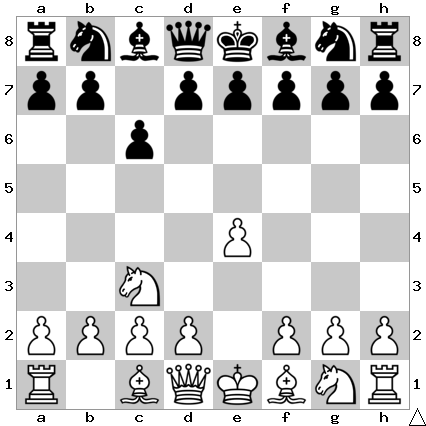

# B10: Caro-Kann Defense

White retains some flexibility with the d pawn and develops quickly.

In this position I play d5.

## Continuations

Move                | Total games | White wins | Draw | Black wins
--------------------|-------------|------------|------|-----------

Todo: d5
