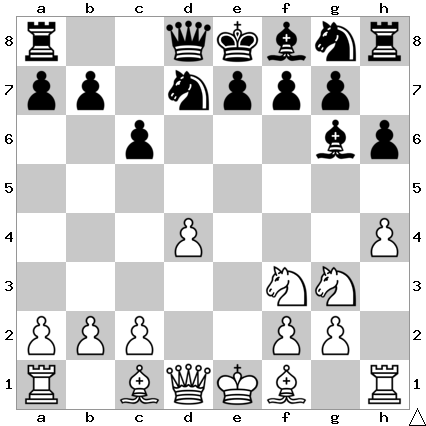

# B15: Caro-Kann Defense

Black also develops a knight naturally. The c6 square is not available, and
the knight on d7 can eventually support a c5 push, which is common in many
positions.

## Continuations

Move                  | Total games | White wins | Draw | Black wins
----------------------|-------------|------------|------|-----------
[h5](h5/index.md)     | 7,654       | 26%        | 55%  | 19%

Todo: Bd3
