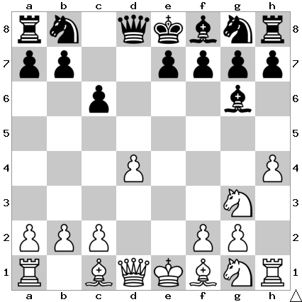

# B15: Caro-Kann Defense

White prepares to attack and trap the bishop with h5, as well as grabbing
some space on the kingside.

In this position I play h6.

## Continuations

Move                  | Total games | White wins | Draw | Black wins
----------------------|-------------|------------|------|-----------
[h6](h6/index.md)     | 9,488       | 27%        | 52%  | 21%

## Mistakes

### h5

This is a natural move to try to restrain White's kingside advance, but it
turns out to be too aggressive, and eventually the h pawn will be weak.
