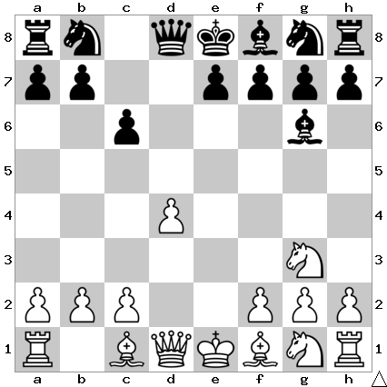

# B15: Caro-Kann Defense

Bg6 simply retreats the bishop while keeping it on an active diagonal.

## Continuations

Move                  | Total games | White wins | Draw | Black wins
----------------------|-------------|------------|------|-----------
[h4](h4/index.md)     | 9.494       | 27%        | 52%  | 21%

Todo: Nf3, Bc4, Nh3, N1e2
