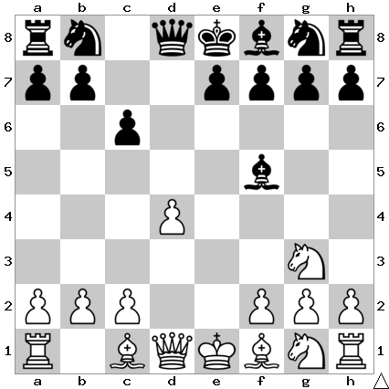

# B15: Caro-Kann Defense

The white knight is under attack, so it retreats while gaining a tempo by
attacking the bishop.

I play Bg6 in this position.

## Continuations

Move                  | Total games | White wins | Draw | Black wins
----------------------|-------------|------------|------|-----------
[Bg6](Bg6/index.md)   | 14,428      | 26%        | 52%  | 22%

