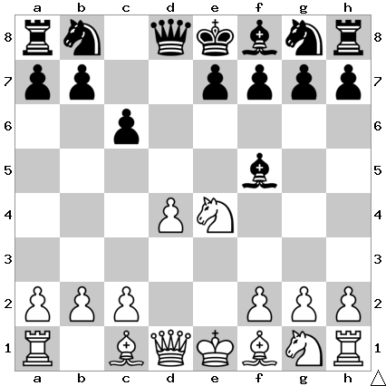

# B15: Caro-Kann Defense

We develop the c8 bishop, which was the point of playing c6 on the first move.

## Continuations

Move                  | Total games | White wins | Draw | Black wins
----------------------|-------------|------------|------|-----------
[Ng3](Ng3/index.md)   | 14,442      | 26%        | 52%  | 22%

## Mistakes

### Bd3

Sometimes people will play Bd3 to defend their knight instead of retreating
with Ng3. This seems natural to try to leave the knight on a strong square, but
Black can just win a pawn with Qxd4. You will lose some time after Nf3, but
White doesn't have enough for the pawn here. After Nf3 I think just retreating
with Qd8 is the best option. After that Black can try to consolidate their
position and catch up in development, then leverage the extra pawn to win.
