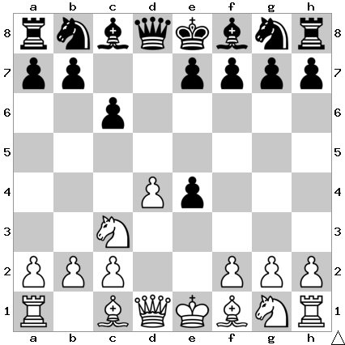

# B15: Caro-Kann Defense

We trade off a central pawn in order to disrupt White's strong pawn center.

## Continuations

Move                  | Total games | White wins | Draw | Black wins
----------------------|-------------|------------|------|-----------

Todo: Nxe4
