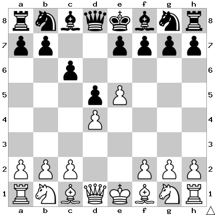

# B12: Caro-Kann: Advance Variation

White avoids exchanging their strong center by pushing the e pawn out of
danger.

In this position I play Bf5.

## Continuations

Move                  | Total games | White wins | Draw | Black wins
----------------------|-------------|------------|------|-----------

Todo: Bf5
