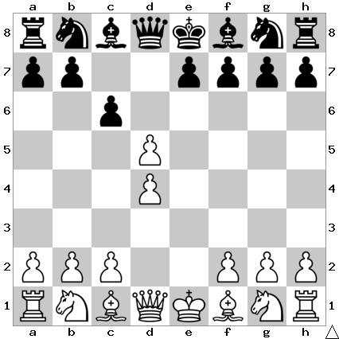

# B13: Caro-Kann: Exchange Variation

White exchanges the central pawns. I tend to think this line is a little weak
since White is already giving Black a central pawn majority.

In this position I play cxd5.

## Continuations

Move                  | Total games | White wins | Draw | Black wins
----------------------|-------------|------------|------|-----------

Todo: cxd5
