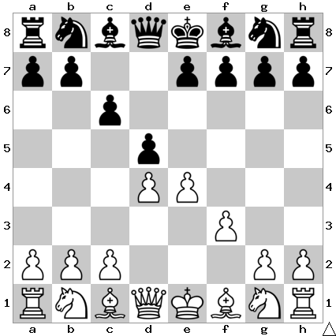

# B12: Caro-Kann: Fantasy Variation

White protects their center with the f pawn to ensure that they maintain two
central pawns even if we exchange. An exchange also opens the f file for their
rook. However, this move does take away the natural development square from the
g1 knight.

In this position I play e6.

## Continuations

Sometimes people will play Nd2 here but it always transposes into the Nc3
lines after 3... dxe4  4. Nxe4.

Move                  | Total games | White wins | Draw | Black wins
----------------------|-------------|------------|------|-----------

Todo: e6
