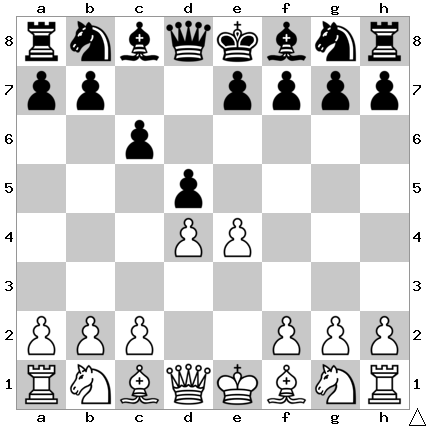

# B12: Caro-Kann Defense

The point of c6 was to play d5 to challenge White's big center.

## Continuations

Sometimes people will play Nd2 here but it always transposes into the Nc3
lines after 3... dxe4  4. Nxe4.

Move                  | Total games | White wins | Draw | Black wins
----------------------|-------------|------------|------|-----------
[e5](e5/index.md)     | 21,346      | 36%        | 41%  | 23%
[Nc3](Nc3/index.md)   | 16,902      | 29%        | 49%  | 23%
[exd5](exd5/index.md) | 13,271      | 29%        | 46%  | 25%
[f3](f3/index.md)     | 1,691       | 37%        | 32%  | 31%

