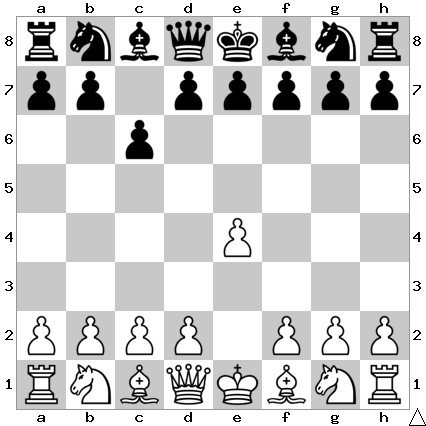

# B10: Caro-Kann Defense

The main idea of c6 is to set up 2... d5 without blocking in the c8 bishop. The
downside compared to 1... e6 is that we take away c6 from the knight, and we
often want to play c5 which will now take an extra tempo.

## Continuations

Move                | Total games | White wins | Draw | Black wins
--------------------|-------------|------------|------|-----------

Todo: d4, Nc3, c4, d3, Nf3
